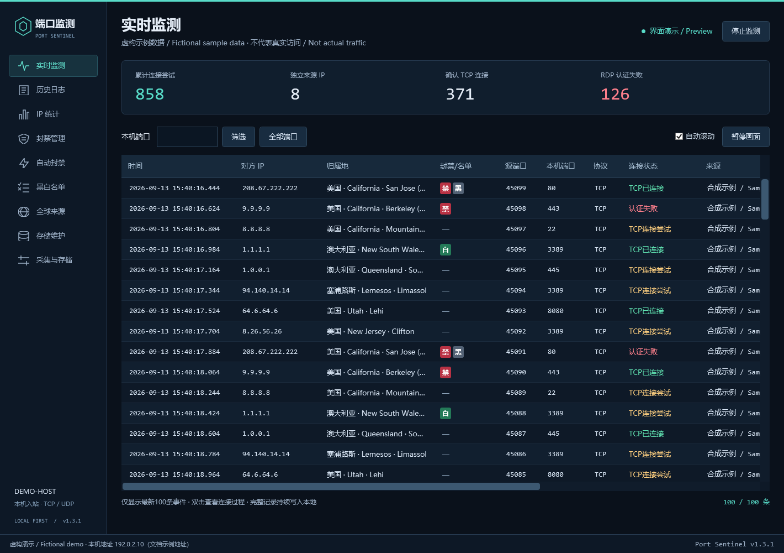
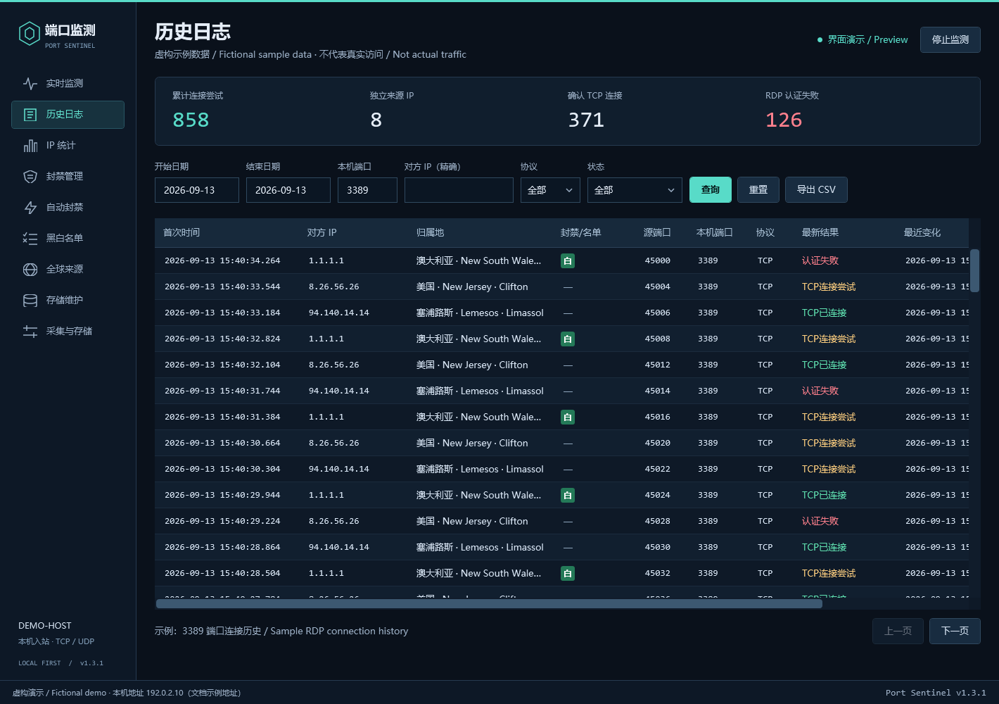
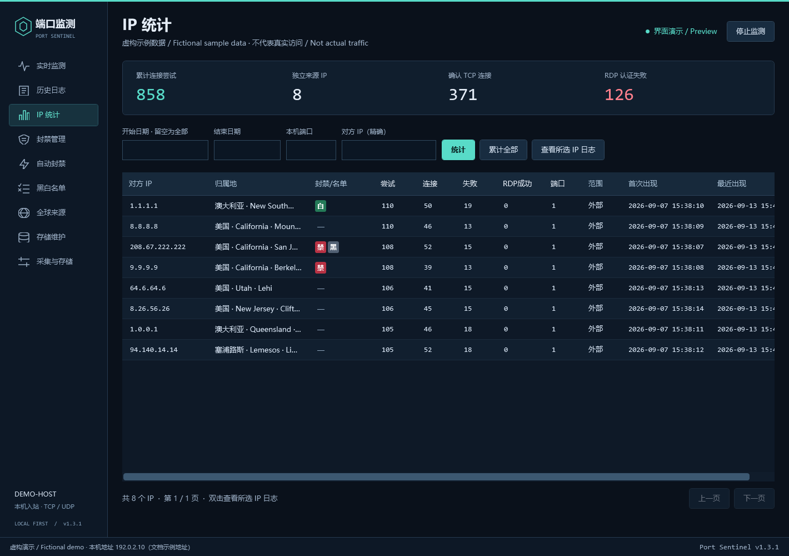
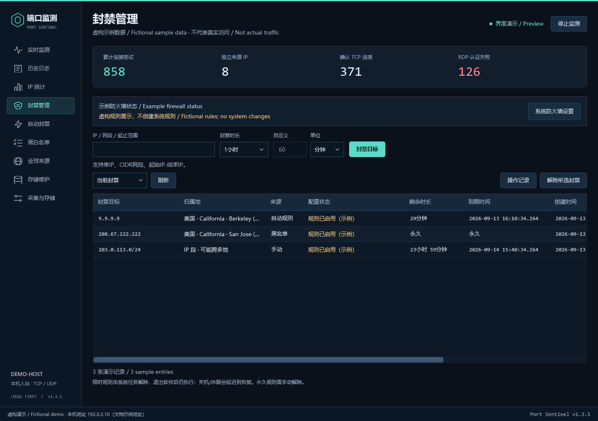
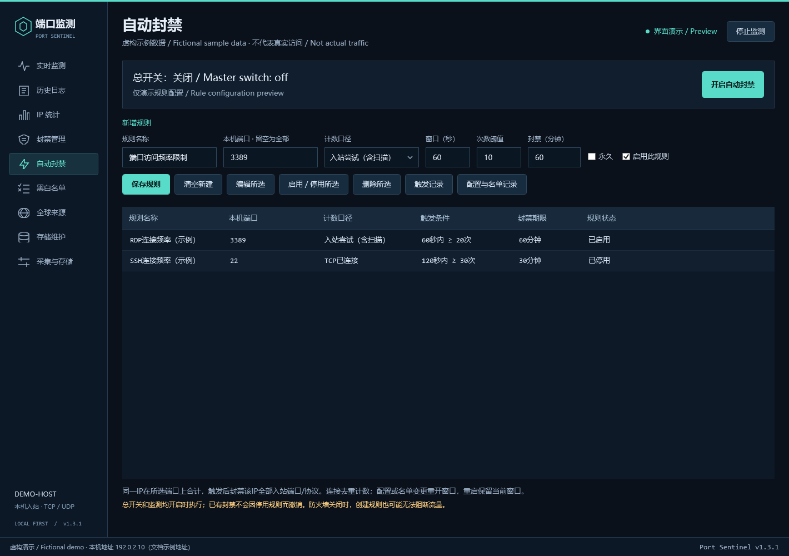
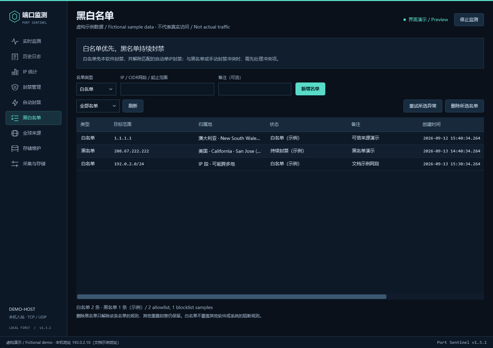
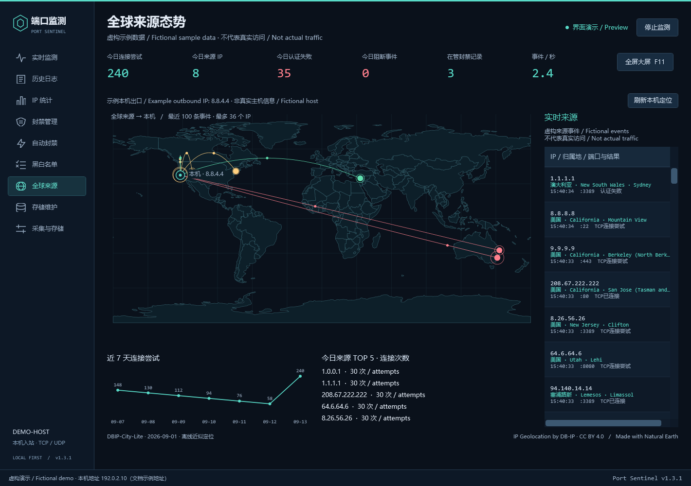
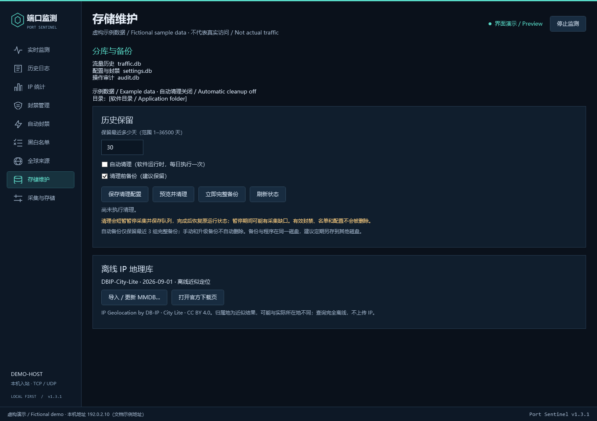
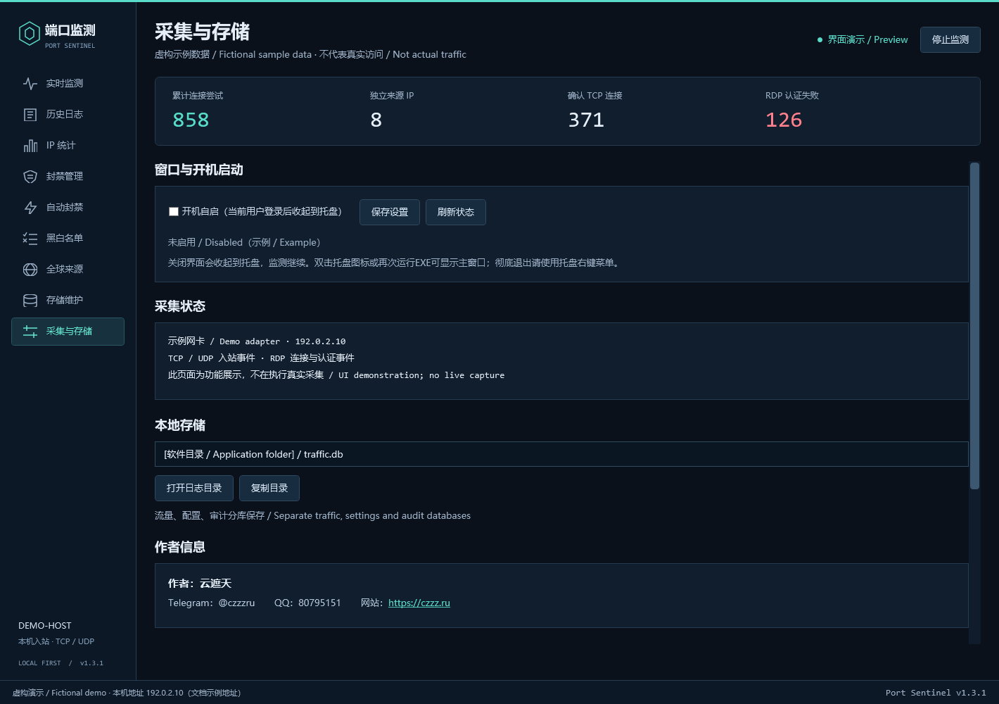

# Port Sentinel — Windows 端口监控 / Windows Port Monitor

**查看谁在连接你的 Windows 电脑：实时端口日志、3389/RDP 连接记录、IP 次数统计、自动封禁与全球来源地图。**

**See who is connecting to your Windows PC: live port logs, port 3389/RDP connection records, per-IP statistics, automatic IP blocking, and a global source map.**

Port Sentinel（端口监测）是一款 Windows 桌面入站连接监控工具，适合需要排查陌生 IP 访问、远程桌面重复连接、端口探测和长期日志增长的个人用户及管理员。程序界面为简体中文；本页和安装指南提供中文与英文说明。

Port Sentinel is a Windows desktop inbound connection monitor for users and administrators investigating unfamiliar IP addresses, repeated Remote Desktop connections, port probes, and growing log files. The application UI is currently in Simplified Chinese; this page and the installation guide provide Chinese and English instructions.

[下载最新版 / Download latest](https://github.com/zuelu/port-sentinel/releases/latest) · [界面截图 / Screenshots](#screenshots) · [安装与使用 / Installation & usage](INSTALL.md) · [更新日志 / Changelog](CHANGELOG.md) · [反馈问题 / Report an issue](https://github.com/zuelu/port-sentinel/issues)

## 快速开始 / Quick start

1. 从 [v1.3.1 Release](https://github.com/zuelu/port-sentinel/releases/tag/v1.3.1) 下载 **PortSentinel-v1.3.1-windows-x64.zip**，解压到可写的固定目录。
   Download **PortSentinel-v1.3.1-windows-x64.zip** from the [v1.3.1 release](https://github.com/zuelu/port-sentinel/releases/tag/v1.3.1) and extract it to a stable, writable folder.
2. 运行 **PortSentinel.exe**，在 Windows 提示时允许管理员权限；保持 `GeoData` 文件夹与 EXE 同目录。
   Run **PortSentinel.exe** and grant administrator permission when Windows asks. Keep the `GeoData` folder beside the EXE.
3. 在“实时监测”输入本机端口，如 `3389`，点击“筛选”。在“历史日志”和“IP 统计”按日期、端口或 IP 回查。
   In **实时监测 (Live Monitor)**, enter a local port such as `3389` and select **筛选 (Filter)**. Use **历史日志 (History)** and **IP 统计 (IP Statistics)** to search by date, port, or IP.

运行要求：Windows 10/11 **x64**、.NET Framework **4.8 或更新版本**、管理员权限。无需安装 Python、Npcap 或浏览器扩展。完整 ZIP 推荐用于首次安装；单独的 EXE 适合已有地理库的更新场景。

Requirements: Windows 10/11 **x64**, .NET Framework **4.8 or later**, and administrator permission. No Python, Npcap, or browser extension is required. The complete ZIP is recommended for a first installation; the standalone EXE is useful when updating an existing installation with its geolocation database.

## 功能页面截图 / Feature screenshots

以下展示 v1.3.1 的 9 个功能页面，均使用虚构演示数据。截图中的地址、连接、规则和主机信息仅用于说明界面，不代表真实流量或相关服务的行为。点击图片可查看大图。

These screenshots show all nine feature pages in v1.3.1 using fictional sample data. Addresses, connections, rules, and host details illustrate the interface only; they do not represent actual traffic or the behavior of the named services. Click an image to view it at full size.

### 实时端口监测 / Live port monitoring

查看最新入站事件、端口、来源 IP、归属地以及当前封禁/名单标签，支持筛选和自动滚动。

View recent inbound events, ports, source IPs, locations, and current block/list badges, with filtering and automatic scrolling.

### 连接历史日志 / Connection history

按日期、端口、IP、协议和状态查询连接记录；示例展示 3389 端口筛选及 CSV 导出入口。

Search connection records by date, port, IP, protocol, and state. This example shows the port 3389 filter and the CSV export control.

### 来源 IP 统计 / Per-IP statistics

比较来源 IP 的尝试次数、TCP 连接、认证失败、涉及端口及首次/最近出现时间。

Compare source IPs by attempts, established TCP connections, authentication failures, destination ports, and first/last seen times.

### 手动封禁管理 / Manual IP block management

为单 IP、CIDR 网段或地址范围设置期限，查看当前状态、剩余时长和解除入口。

Set durations for individual IPs, CIDR networks, or address ranges, and inspect current state, remaining time, and removal controls.

### 自动封禁规则 / Automatic IP blocking rules

配置端口、计数方式、时间窗口、次数阈值和封禁时长，总开关与单条规则开关分别控制。

Configure ports, counting mode, time window, threshold, and block duration. The master switch and individual rule switches are separate.

### 黑白名单 / Allowlist and blocklist

集中管理可信来源与持续封禁范围，查看归属地、状态和备注。

Manage trusted sources and persistent block ranges in one place, with locations, states, and notes.

### 全球来源大屏 / Global source dashboard

用地图、动态连线、7 日趋势和来源排行观察本机收到的事件；顶部显示出口定位信息，支持全屏。

Observe events received by the computer through a map, animated paths, a 7-day trend, and source rankings. Outbound location information appears above the map, with fullscreen support.

### 存储维护与日志保留 / Storage maintenance and log retention

设置历史保留天数、自动清理和备份，并管理离线 IP 地理库。

Configure retention days, automatic cleanup, and backups, and manage the offline IP geolocation database.

### 采集状态、托盘与自启 / Capture status, tray operation, and startup

查看采集能力和存储位置，配置当前用户登录自启，并了解窗口收起到托盘的行为。

Inspect capture capabilities and storage location, configure startup at the current user's sign-in, and review how closing the window hides it to the tray.

## 功能与使用场景 / Features and use cases

| 使用需求 / Need | Port Sentinel 的功能 / What Port Sentinel provides |
|---|---|
| 谁在扫描或连接本机端口？ / Who is probing or connecting to my ports? | 显示时间、来源 IP、本机端口、协议和连接状态；实时列表保留最新 **100 条**。 / Timestamps, source IPs, local ports, protocols, and connection states; the live view shows the latest **100 events**. |
| 如何查看 3389 远程桌面连接日志？ / How can I view port 3389 Remote Desktop connection logs? | 按端口筛选 TCP 尝试、已建立连接及可用的 RDP 认证/会话事件。 / Filter TCP attempts, established connections, and available RDP authentication/session events by port. |
| 哪个 IP 尝试连接最多？ / Which IP has made the most connection attempts? | 按来源 IP 汇总尝试次数、TCP 连接、认证失败、目标端口数量和首次/最近出现时间。 / Per-IP attempt totals, established TCP connections, authentication failures, distinct destination ports, and first/last seen times. |
| 如何自动封禁频繁访问的 IP？ / How can I automatically block frequent visitors? | 按指定端口、统计窗口、连接次数设置规则及封禁时长，支持手动封禁与黑白名单。 / Configure ports, a time window, an attempt/connection threshold, and a block duration; manual blocking and allow/block lists are also available. |
| 如何查看来源 IP 的地理位置？ / How can I see source IP locations? | 使用离线 DB-IP City Lite，在列表和全球来源大屏显示近似地理位置。 / Use offline DB-IP City Lite data for approximate locations in lists and the global source dashboard. |
| 如何限制日志占用空间？ / How can I control log storage growth? | 流量、配置和审计分库保存，支持按保留天数手动/自动清理和完整备份。 / Separate traffic, settings, and audit databases, with age-based manual/automatic cleanup and complete backups. |
| 能否关闭窗口后继续监控？ / Can monitoring continue after I close the window? | 关闭窗口收起至系统托盘，支持托盘恢复、退出及可选的登录自启。 / Closing the window hides it to the system tray; restore, exit, and optional startup at user sign-in are supported. |

## 3389/RDP 监控与 IP 自动封禁 / RDP monitoring and automatic IP blocking

先观察正常访问频率，再为需要保护的端口设置阈值。自动规则按“入站尝试”或“TCP 已连接”计数，支持跨多个指定端口合计。可配置 IPv4/IPv6 单地址、CIDR 网段或起止范围的手动封禁；白名单在本软件策略中优先。

Observe normal access patterns before choosing a threshold. Automatic rules count inbound attempts or established TCP connections and can combine activity across selected ports. Manual blocking supports individual IPv4/IPv6 addresses, CIDR networks, and address ranges. Allowlist entries take priority within this application's policies.

**重要：规则中的端口用于触发统计；触发后封禁该来源 IP 的全部入站端口和协议。** 这可能影响已有远程管理连接。不要把 TCP 连接成功当作账号登录成功，也不要仅凭一次连接判定对方恶意。使用前请阅读[封禁配置说明](INSTALL.md#blocking)。

**Important: a rule's port filter controls its trigger count; once triggered, the source IP is blocked across all inbound ports and protocols.** This can affect existing remote administration sessions. An established TCP connection does not prove a successful account login, and a single connection is not evidence of malicious intent. Read the [blocking instructions](INSTALL.md#blocking) before enabling rules.

RDP 默认使用 3389，但你的环境可能已改端口。有关端口和连接排查，参见 Microsoft 的 [RDP 端口说明](https://learn.microsoft.com/en-us/windows-server/remote/remote-desktop-services/remotepc/change-listening-port)。

RDP uses port 3389 by default, but your environment may use a different port. See Microsoft's [RDP listening-port documentation](https://learn.microsoft.com/en-us/windows-server/remote/remote-desktop-services/remotepc/change-listening-port) when checking your setup.

## 全球来源大屏与离线 IP 定位 / Global source dashboard and offline IP geolocation

大屏展示本机收到的入站事件、今日来源 IP、认证失败、可观察到的防火墙阻断、7 日连接趋势和来源 TOP 5。支持 **F11** 全屏和 **Esc** 返回。它不是全球互联网攻击情报服务，也不进行 HTTP 漏洞利用识别。

The dashboard displays inbound events received by this computer, today's source IPs, authentication failures, observable firewall drops, a 7-day connection trend, and the top five sources. Press **F11** for fullscreen and **Esc** to return. It is not an Internet-wide attack-intelligence feed and does not identify HTTP exploit payloads.

本机落点使用物理网卡直连检测的出口 IPv4，要求两个服务回显一致。不使用 HTTP/SOCKS、系统/PAC 或环境变量代理；无法确认路由时不采用检测结果。网关透明转发无法仅凭客户端彻底排除，IP 地理位置也不等于设备或人员的精确物理位置。

The destination marker uses an outbound IPv4 address checked through direct connections bound to a physical network interface, with matching responses from two services. It does not use HTTP/SOCKS, system/PAC, or environment-variable proxies; an unconfirmed route is not accepted. A client cannot completely rule out transparent forwarding upstream, and IP geolocation is not a precise physical location of a device or person.

来源归属地查询使用随包附带的 [DB-IP City Lite](https://db-ip.com/db/download/ip-to-city-lite)，不逐条上传日志中的 IP；世界底图来自 [Natural Earth](https://www.naturalearthdata.com/)。可在“存储维护”中导入新版城市 MMDB 数据库。

Source locations are looked up in the bundled [DB-IP City Lite](https://db-ip.com/db/download/ip-to-city-lite) database without uploading individual logged IPs. The basemap is from [Natural Earth](https://www.naturalearthdata.com/). Import an updated City MMDB file in **存储维护 (Storage Maintenance)** when needed.

## 常见问题 / Frequently asked questions

### 能看到软件启动前的连接吗？ / Can it show connections from before the application started?

软件主要记录运行期间观察到的流量和实时 Windows 事件。它不能恢复此前没有记录或已经覆盖的网络历史。启动时发现的既有连接会与新发起的连接区分处理。

The application primarily records traffic and live Windows events observed while it is running. It cannot recover network history that was never recorded or has already been overwritten. Connections already present at startup are handled separately from newly initiated connections.

### 是否保证记录所有端口扫描和登录失败？ / Does it capture every port scan and failed login?

不保证。可见范围受系统权限、网卡、系统审核配置和采集负载影响。防火墙阻断事件需要相应 Windows 审核事件可用；其他协议的账号认证结果不等同于 RDP 认证事件。

No. Visibility depends on permissions, network interfaces, Windows audit configuration, and capture load. Firewall-drop records require the corresponding Windows audit events. Authentication results from other protocols are not equivalent to RDP authentication events.

### 为什么关闭窗口后程序还在运行？ / Why is it still running after I close the window?

关闭按钮会收起到右下角托盘，以便继续采集。要完全结束程序，请右键托盘图标选择“退出端口监测”。退出会保存待写入日志并等待正在执行的单条防火墙操作安全完成。

The close button hides the application to the notification area so collection can continue. To stop it completely, right-click the tray icon and choose **退出端口监测 (Exit Port Sentinel)**. Exit flushes queued logs and lets an in-progress individual firewall operation finish safely.

### 清理历史会解除封禁吗？ / Does clearing history remove active blocks?

不会。历史清理保留有效封禁、当前名单和配置，但累计 IP 统计会随着被删除的历史记录减少。自动清理默认关闭，预设保留 30 天，并默认在清理前备份。

No. Cleanup preserves active blocks, current lists, and settings, while per-IP totals decrease as old history is removed. Automatic cleanup is off by default, with a preset retention of 30 days and a backup-before-cleanup option enabled by default.

### 删除 EXE 就能恢复所有网络规则吗？ / Does deleting the EXE remove its firewall rules?

不能。永久封禁和部分系统状态不会因删除 EXE 自动撤销。卸载前请按[卸载说明](INSTALL.md#uninstall)解除不再需要的封禁并关闭自启。

No. Permanent blocks and other operating-system state are not automatically undone by deleting the EXE. Before removal, follow the [uninstallation instructions](INSTALL.md#uninstall) to remove unwanted blocks and disable startup.

## 获取与支持 / Downloads and support

需要 Windows 入站端口日志、RDP 连接监控或 IP 频率封禁时，可以从 [Releases](https://github.com/zuelu/port-sentinel/releases/latest) 获取程序，并按[安装使用指南](INSTALL.md)完成配置。报告问题时，请描述操作步骤、Windows 版本及程序版本，不要在公开 Issue 中填写密码、凭据或私人日志。

For Windows inbound port logging, RDP connection monitoring, or frequency-based IP blocking, download the application from [Releases](https://github.com/zuelu/port-sentinel/releases/latest) and follow the [installation guide](INSTALL.md). When reporting a problem, describe the steps, Windows version, and application version; do not post passwords, credentials, or private logs in a public issue.

## 作者 / Author

作者：云遮天，Telegram：@czzzru，QQ：80795151，网站：[https://czzz.ru](https://czzz.ru)

Author: 云遮天 (Yun Zhe Tian) · Telegram: @czzzru · QQ: 80795151 · Website: [https://czzz.ru](https://czzz.ru)
